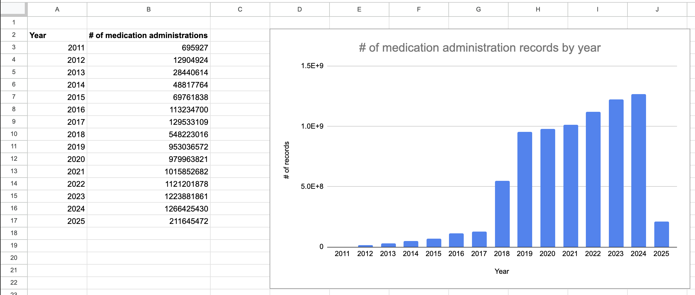

# Guidance On Completeness of Medication Administrations

In the June 2025 LTCDC data cut, medication administration files are separated into years, from 2011 to 2025. Below is the distribution of the number of records in each year.

| Year | # of medication administration records |
| -------- | -------- |
| 2011 | 695,927 |
| 2012 | 12,904,924 |
| 2013 | 28,440,614 |
| 2014 | 48,817,764 |
| 2015 | 69,761,838 |
| 2016 | 113,234,700 |
| 2017 | 129,533,109 |
| 2018 | 548,223,016 |
| 2019 | 953,036,572 |
| 2020 | 979,963,821 |
| 2021 | 1,015,852,682 |
| 2022 | 1,121,201,878 |
| 2023 | 1,223,881,861 |
| 2024 | 1,266,425,430 |
| 2025 | 211,645,472 |

As expected, we can see that years 2019-2024 have substantially higher counts than other years. Since this data cut was released in the middle of 2025, it makes sense that the count for 2025 is low. For years prior to 2019, the low counts suggest incomplete medication administration data. This is supported by the LTCDC release notes, which list January 2019 to February 2025 as the dates of EHR data available in the June 2025 data cut. 

These findings suggest that studies using the June 2025 data cut should define their study period to avoid reliance on medication administration records prior to January 2019, as well as data after February 2025, as data completeness outside of that date range may be limited. Similar considerations should be made as further data cuts are released.

